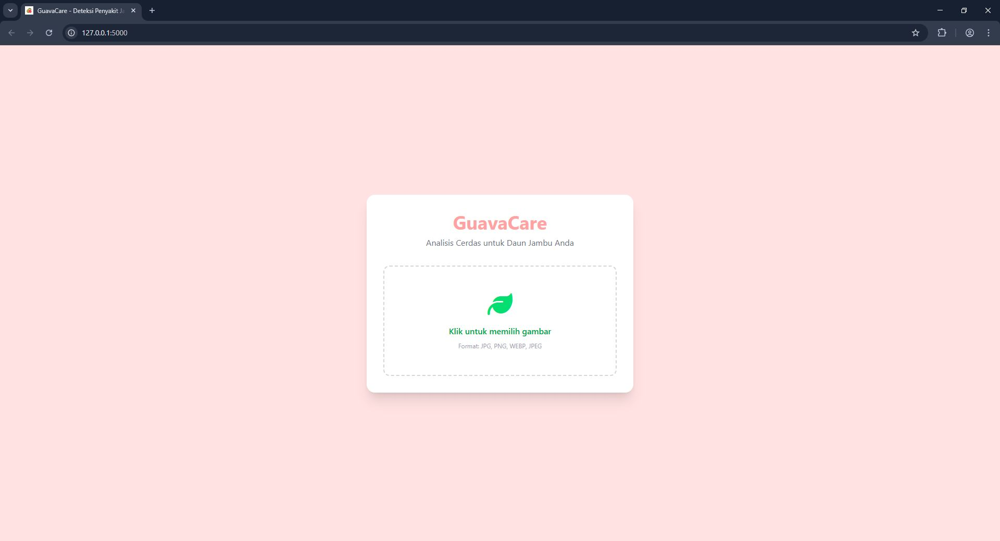
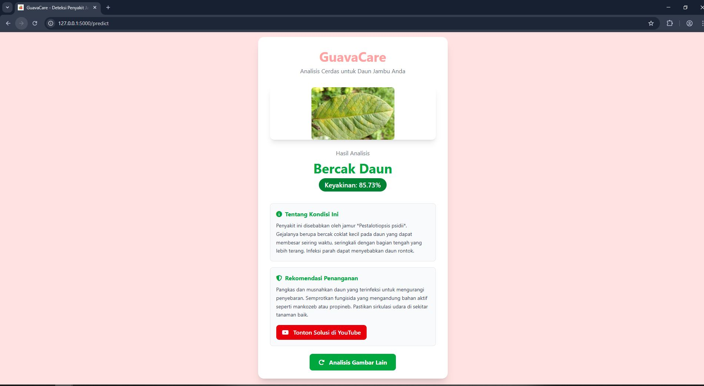
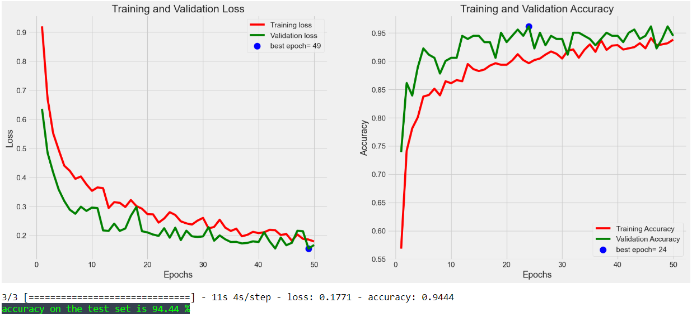

# 🍃 GuavaCare: Deteksi Penyakit Jambu Kristal dengan CNN

> **Final Year Project (Thesis)** | **Computer Science**

   




## 📖 Tentang Proyek

Proyek ini merupakan implementasi dari Tugas Akhir (Skripsi) dengan judul:
**"Application of Convolutional Neural Network to Diagnose Diseases in Crystal Guava Plants"**.

Fokus utama penelitian ini adalah mengeksplorasi dan mengoptimalkan arsitektur *Deep Learning* untuk mengenali pola visual penyakit pada citra daun jambu kristal. Web-based application pada repository ini dibangun sebagai **Deployment Environment** untuk menguji performa model yang telah dilatih dalam skenario penggunaan nyata (End-User Implementation).

Sistem dilatih untuk membedakan tiga kelas klasifikasi utama sesuai data lapangan:
1.  **Karat Merah** (*Red Rust* - Cephaleuros virescens)
2.  **Bercak Daun** (*Leaf Spot*)
3.  **Daun Sehat** (*Healthy*)

### 🔬 Research Contribution
* **Model Comparison:** Melakukan analisis komparatif performa antara arsitektur Xception, VGG16, ResNet50, dan InceptionV3.
* **Model Optimization:** Menemukan bahwa arsitektur **Xception** memberikan hasil evaluasi terbaik (Akurasi/Loss) untuk karakteristik dataset penyakit jambu.
* **Applied AI:** Mengimplementasikan model hasil pelatihan ke dalam antarmuka web sederhana untuk membuktikan *usability* model bagi petani/pengguna awam.

---

## 🛠️ Teknologi yang Digunakan

Proyek ini menggabungkan teknologi *Machine Learning* dan *Web Development*:

### Backend & AI
* **Bahasa:** Python 3.10
* **Framework:** Flask (Microframework)
* **Machine Learning:** TensorFlow & Keras
* **Model Arsitektur:** Xception (Best Performing Model)
* **Image Processing:** Pillow (PIL) & Numpy

### Frontend
* **Markup & Style:** HTML5, CSS3, Tailwind CSS
* **Interaktivitas:** JavaScript (Vanilla)

---

## 📂 Struktur Direktori

```bash
GuavaDiseasesDetection/
├── app.py                 # Main controller aplikasi (Flask)
├── models/                # Penyimpanan model CNN yang telah dilatih
│   ├── Xception2L.h5      # Model utama yang digunakan (Production)
│   ├── VGG16.h5           # Model pembanding
│   └── ...
├── static/
│   ├── css/               # File CSS (Tailwind Output)
│   ├── js/                # Logika frontend
│   └── uploads/           # Direktori sementara uploads user
├── templates/
│   └── classifications.html # Halaman antarmuka utama
└── README.md
```

## 🚀 Instalasi dan Cara Menjalankan
Ikuti langkah-langkah berikut untuk menjalankan proyek di lingkungan lokal (Localhost):

### Prasyarat
Pastikan Anda memiliki Python 3.9 - 3.11 terinstal (Direkomendasikan Python 3.10 untuk kompatibilitas terbaik dengan TensorFlow).

### 1. Clone Repository
```bash
git clone [https://github.com/username-anda/GuavaDiseasesDetection.git](https://github.com/username-anda/GuavaDiseasesDetection.git)
cd GuavaDiseasesDetection
```
### 2. Buat Virtual Environment
```bash
# Windows
python -m venv venv
venv\Scripts\activate

# Mac/Linux
source venv/bin/activate
```
### 3. Install Dependencies
```bash
pip install flask numpy pillow tensorflow==2.15.0 "numpy<2.0" werkzeug
````

### 4. Jalankan Aplikasi
```bash
python app.py
```

### 5. Akses Website
```angular2html
http://127.0.0.1:5000
```

## 🛠️ Tech Stack & Methodology

Proyek ini menitikberatkan pada *pipeline* Machine Learning, mulai dari preprocessing hingga deployment:

### Machine Learning Pipeline
* **Core Engine:** TensorFlow & Keras
* **Architecture:** Xception (Transfer Learning dengan Fine-Tuning)
* **Image Preprocessing:** Rescaling, Augmentation, dan resizing ke target input (128x128).
* **Evaluation Metrics:** Confusion Matrix, Accuracy, Loss Validation.

### Deployment Environment
* **Backend:** Flask (Python) - Berfungsi sebagai *Inference Server* untuk memuat model `.h5` dan memproses request gambar.
* **Frontend Interface:** HTML5 & Tailwind CSS - Antarmuka pengguna untuk mengunggah sampel uji (Testing Data).

---

## 📊 Model Performance Highlights

Berdasarkan salah satu hasil pengujian validasi model:



Model mampu mengklasifikasikan citra uji dengan presisi tinggi, tetapi memiliki kekurangan seperti Kesulitan membedakan Penyakit dengan Ciri Visual Mirip,
Tidak Tahan Terhadap Data Asing (Out-of-Distribution),Keterbatasan Sudut Pandang Data Latih

👨‍💻 Author
Ali Mustadji Fresh Graduate, Computer Science

Saya adalah pengembang web junior memiliki minat pada aplikasi praktis. Proyek ini adalah demonstrasi kemampuan saya dalam membangun solusi end-to-end, mulai dari pelatihan model hingga deployment aplikasi web.